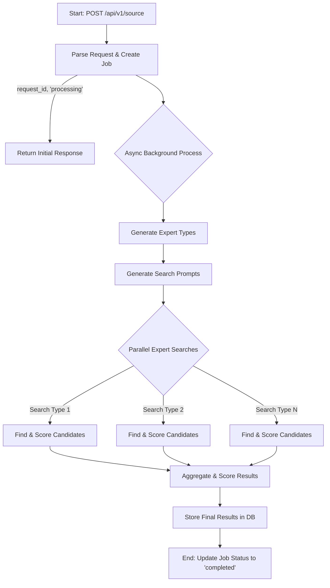

# Expert Contacts Microservice - Product Specification

## 1. Product Overview

### 1.1 Purpose
The Expert Contacts Microservice is an AI-powered expert discovery system that leverages advanced LLMs with web search capabilities to identify and recommend domain experts for specific business needs. It automatically sources real professionals with verified LinkedIn profiles, evaluates their relevance, and provides structured contact information for outreach.

### 1.2 Core Value Proposition
- **AI-Powered Discovery**: Intelligent expert identification using GPT-4o and o3 models.
- **Real Professional Profiles**: Verified LinkedIn URLs and contact information.
- **Relevance Scoring**: Multi-dimensional matching based on skills, experience, and domain expertise.
- **Scalable Sourcing**: Find multiple experts across any domain in seconds.

### 1.3 Target Use Cases
Sourcing domain experts for consulting, advisory roles, technical reviews, and strategic partnerships.

## 2. Functional Specifications

### 2.1 Input Parameters
**Expert Sourcing Request**
```json
{
  "project_description": "string" // Detailed project/need description
}
```

### 2.2 Output Structure
**Sourcing Response**
```json
{
  "request_id": "uuid",
  "status": "completed",
  "experts": [
    {
      "id": "uuid",
      "name": "Expert Name",
      "title": "Current Professional Title",
      "company": "Current Company",
      "linkedin_url": "https://linkedin.com/in/profile",
      "email": "email@domain.com",
      "relevance_score": 0.95,
      "matching_reasons": [
        "10+ years in domain X",
        "Published research on topic Y",
        "Led similar projects at Company Z"
      ],
      "personalised_message": "string"
    }
  ],
  "metadata": {
    "created_at": "ISO timestamp",
    "processing_time_seconds": 8.5
  }
}
```

## 3. API Endpoints

### 3.1 Expert Sourcing

**POST /api/v1/source**
Initiates an asynchronous AI-powered expert discovery job.

Request:
```json
{
  "project_description": "Need blockchain expert for DeFi protocol audit"
}
```

Response:
```json
{
  "request_id": "550e8400-e29b-41d4-a716-446655440000",
  "status": "processing",
  "message": "Expert sourcing initiated. Check status using GET /api/v1/source/{request_id}"
}
```

**GET /api/v1/source/:id**
Retrieve the status and results of a specific sourcing request.

Response (when completed):
```json
{
  "request_id": "550e8400-e29b-41d4-a716-446655440000",
  "status": "completed",
  "experts": [...], // Final, scored experts as in section 2.2
  "metadata": {...},
  "raw_outputs": {
    "expert_types": [...], // Raw output from expert type generation
    "search_prompts": [...], // Generated search prompts
    "search_results": [...] // Raw, unaggregated search results from o3, including the relevancy_to_type_score
  }
}
```

## 4. AI Models and Prompts

### 4.1 Expert Type Generation
- **Model**: GPT-4o
- **Web Search**: OFF
- **System Prompt**: I am looking for experts to help me validate a topic. Based on the project description, what specific types of experts should I target? For each type, provide a title, a reason ("why") they are relevant, and assign an importance score from 0.0 to 1.0 for each expert type.
- **User Input**: Project description
- **Output Schema**:
```json
[
  {
    "expert_title": "string",
    "why": "string",
    "importance_score": 0.9
  }
]
```

### 4.2 Expert Search Prompt Generation
- **Model**: GPT-4o
- **Web Search**: OFF
- **User Prompt**: I'm looking to validate the following project:\n{project description}\nTo do this, I'm looking for an expert like a {title} because {focus}.\nHelp me write a search prompt based on this need, using the provided template.
- **Output Format**:
```
### SYSTEM
You are an elite research assistant and head-hunter.
Your job: surface INDIVIDUAL consultants (no firms) who combine
[[RELEVANT EXPERIENCE OF THE PEOPLE I AM LOOKING FOR]]
and have PROOF of thought-leadership (articles, talks, open-source tools).

### TASK
1. **Search strategy**
▸ Use [[LinkedIn, personal sites, academic papers, conference agendas OR ANY OTHER RESOURCE]].
▸ Prioritise keywords: [[RELEVANT SEARCHES]]
▸ [[ANY ADDITIONAL FOCUSES]].

2. **Short-list 8-12 candidates** who meet ≥ 3 of the following:
- Published in the last 3 years on [[TOPIC THEY SHOULD BE EXPERT ON]]
- [[DEMONSTRATED HANDS ON EXPERIENCE RELEVANT TO THE TOPIC]]

3. For EACH candidate, return a JSON object with: name, title, company, linkedin_url, email, matching_reasons (as an array of strings), relevancy_to_type_score (a number from 0.0 to 1.0 indicating how well they match this specific expert type), responsiveness, and a personalised_message.

### CONSTRAINTS
- Individuals only (no brokerages or consulting firms).
- Find a public email where possible.
- Cite every claim with a hyperlink inside the matching_reasons.

### EXAMPLE OUTPUT (structure only)
[
  {
    "name": "John Doe",
    "title": "Principal Blockchain Architect",
    "company": "Tech Solutions Inc.",
    "linkedin_url": "https://linkedin.com/in/johndoe",
    "email": "john.doe@example.com",
    "matching_reasons": ["Led the development of a DeFi protocol at ExampleCorp", "Published a paper on zero-knowledge proofs"],
    "relevancy_to_type_score": 0.95,
    "responsiveness": "High",
    "personalised_message": "A personalized WIIFM-oriented message to get them to consult."
  }
]
```

### 4.3 Expert Search Execution
- **Model**: o3
- **Web Search**: ON
- **Output Format**: JSON
- **User Input**: Generated expert search prompt from 4.2
- **Expected Output Schema**:
```json
[
  {
    "name": "string",
    "title": "string",
    "company": "string",
    "linkedin_url": "string",
    "email": "string",
    "matching_reasons": ["array of strings"],
    "relevancy_to_type_score": 0.9,
    "responsiveness": "High|Medium|Low",
    "personalised_message": "string"
  }
]
```

## 5. Database Schema

### 5.1 Core Tables

**experts**
Stores unique expert profiles (canonical data).
```sql
CREATE TABLE experts (
    id TEXT PRIMARY KEY,
    name TEXT NOT NULL,
    title TEXT,
    company TEXT,
    linkedin_url TEXT UNIQUE NOT NULL,
    email TEXT, -- Stores the most recently verified email
    created_at TIMESTAMP DEFAULT CURRENT_TIMESTAMP,
    updated_at TIMESTAMP DEFAULT CURRENT_TIMESTAMP
);
```

**expert_sourcing_requests**
Tracks each sourcing request.
```sql
CREATE TABLE expert_sourcing_requests (
    id TEXT PRIMARY KEY,
    project_description TEXT NOT NULL,
    status TEXT DEFAULT 'pending', -- pending, processing, completed, failed
    created_at TIMESTAMP DEFAULT CURRENT_TIMESTAMP,
    completed_at TIMESTAMP
);
```

**expert_request_matches**
Links experts to a request with all request-specific data.
```sql
CREATE TABLE expert_request_matches (
    id TEXT PRIMARY KEY,
    request_id TEXT NOT NULL,
    expert_id TEXT NOT NULL,
    relevance_score REAL,
    email TEXT, -- The specific email found for this request
    matching_reasons TEXT, -- JSON array of strings
    personalised_message TEXT,
    responsiveness TEXT,
    created_at TIMESTAMP DEFAULT CURRENT_TIMESTAMP,
    FOREIGN KEY (request_id) REFERENCES expert_sourcing_requests(id),
    FOREIGN KEY (expert_id) REFERENCES experts(id)
);
```

**expert_sourcing_raw_outputs**
Stores all raw JSON outputs from the AI models for each request for full traceability.
```sql
CREATE TABLE expert_sourcing_raw_outputs (
    id TEXT PRIMARY KEY,
    request_id TEXT NOT NULL,
    expert_types TEXT, -- Raw JSON from GPT-4o
    search_prompts TEXT, -- Raw text/JSON of generated prompts
    search_results TEXT, -- Raw JSON from o3, which includes relevancy_to_type_score
    created_at TIMESTAMP DEFAULT CURRENT_TIMESTAMP,
    FOREIGN KEY (request_id) REFERENCES expert_sourcing_requests(id)
);
```

## 6. Monitoring and Analytics

### 6.1 Key Metrics
- **Operational Metrics**: API response times, Job processing times, Expert discovery success rate, Search accuracy scores, Database query performance, OpenAI API usage and costs.
- **Business Metrics**: Experts sourced per request, Contact conversion rates, User satisfaction scores, Most requested skills/domains, Geographic distribution of experts.

### 6.2 Logging
Structured logging with Pino:
```javascript
logger.info({ 
  request_id: 'uuid', 
  experts_found: 12, 
  processing_time: 8500, 
  ai_tokens_used: 2500 
}, 'Expert sourcing completed');
```

### 6.3 Error Tracking
- Failed API requests
- Job processing failures
- LinkedIn URL validation failures
- AI model errors
- Database connection issues
- Rate limit violations

## 7. Architecture and Orchestration on Google Cloud Platform (GCP)

This section details the architectural design for the Expert Contacts Microservice on Google Cloud Platform (GCP). The architecture is designed to be robust, scalable, and capable of managing long-running, multi-step LLM workflows, while also supporting multiple deployment environments.

### 7.1 Core Principles
- **Serverless First**: To minimize operational overhead and scale seamlessly, the architecture prioritizes serverless components. This means you only pay for the resources you consume, from compute to workflow executions.
- **Asynchronous and Event-Driven**: Given that the expert sourcing process can take up to 15 minutes, the entire workflow is asynchronous. The initial API call returns immediately, and the long-running process is handled in the background.
- **Decoupled Services**: Each phase of the expert discovery pipeline (expert type generation, prompt generation, searching, aggregation) is a distinct, decoupled service. This enhances maintainability, testability, and allows for independent scaling of each component.
- **Infrastructure as Code (IaC)**: To ensure consistency and repeatability across environments, all GCP resources will be provisioned and managed using Terraform.

### 7.2 GCP Services Overview

| Service | Purpose | Rationale |
|---------|---------|-----------|
| Cloud Run | Hosts the primary API and the individual, containerized microservices for each step of the workflow. | A fully managed platform ideal for containerized applications, it scales automatically (even to zero) and integrates seamlessly with other GCP services. |
| Cloud Workflows | Orchestrates the entire expert discovery pipeline, from start to finish. | A powerful, serverless orchestration engine that connects the different microservices in the correct sequence, handles retries, and manages state throughout the long-running process. |
| Cloud Tasks | Decouples the initial API request from the long-running workflow. | When a request is received, a task is created and placed on a queue, which then triggers the Cloud Workflow. This provides durability and smooths out traffic spikes. |
| Cloud SQL (PostgreSQL) | Serves as the primary relational database. | A fully managed PostgreSQL service that provides the necessary relational structure for storing experts, requests, and results, while handling backups, replication, and scaling. |
| Cloud Storage | Stores raw outputs from the AI models. | A highly scalable and durable object storage solution, perfect for storing large JSON or text files generated during the process. |
| Artifact Registry | Stores and manages the Docker container images for the microservices. | A secure, private registry for your container images, integrated with GCP's CI/CD and deployment services. |
| Cloud Build | Implements the Continuous Integration and Continuous Deployment (CI/CD) pipeline. | Automates the process of building, testing, and deploying the application across different environments. |
| Secret Manager | Securely stores and manages sensitive information like API keys and database credentials. | Provides a centralized and secure way to manage secrets, with fine-grained access control. |

### 7.3 Detailed Orchestration Flow

Here's a step-by-step breakdown of how a request is processed:

1. **Request Initiation**: A user sends a POST request to the /api/v1/source endpoint, which is hosted on a Cloud Run service.
2. **Task Enqueueing**: The Cloud Run service validates the request and creates a new task in a Cloud Tasks queue. This task contains the project_description and other relevant metadata. A request_id is generated and returned to the user immediately.
3. **Workflow Triggering**: Cloud Tasks securely invokes a Cloud Workflow execution. This is the starting point of the main asynchronous process.
4. **Expert Type Generation**: The Cloud Workflow calls the "Expert Type Generation" microservice (a separate Cloud Run service). This service communicates with the GPT-4o model to generate the expert archetypes.
5. **Search Prompt Generation**: For each expert type identified, the Cloud Workflow calls the "Search Prompt Generation" microservice (another Cloud Run service).
6. **Parallel Expert Search**: The Cloud Workflow then triggers multiple parallel executions of the "Expert Search Execution" microservice (a Cloud Run service with the o3 model). Each execution receives a different search prompt. To handle potentially long-running searches, these Cloud Run services will have their timeout configured appropriately.
7. **Aggregation and Scoring**: Once all the parallel search executions are complete, the Cloud Workflow calls the "Result Aggregation" microservice. This service fetches all the raw results, resolves duplicates, calculates the final relevance scores, and prepares the final list of experts.
8. **Database Storage**: The "Result Aggregation" service then writes the final, structured data to the Cloud SQL database and the raw outputs to Cloud Storage.
9. **Status Update**: Finally, the workflow updates the status of the request in the database to "completed".

### 7.4 Multi-Environment Strategy

To support development, staging, and production environments, the following strategy will be employed:

- **Separate GCP Projects**: The most robust and recommended approach for environment isolation on GCP is to use separate projects for each environment (e.g., expert-contacts-dev, expert-contacts-staging, expert-contacts-prod). This provides the highest level of security and prevents resources from different environments from interfering with each other.
- **Branch-Based Deployments**: The CI/CD pipeline in Cloud Build will be configured to trigger deployments based on the Git branch:
  - develop branch -> Deploys to the dev environment.
  - staging branch -> Deploys to the staging environment.
  - main branch -> Deploys to the production environment.
- **Terraform Workspaces**: Terraform workspaces will be used to manage the infrastructure for each environment from the same set of configuration files, with environment-specific variables (e.g., database instance sizes, replica counts) passed in as needed.

### 7.5 CI/CD Pipeline with Cloud Build

The cloudbuild.yaml file will define a series of steps to automate the deployment process:

1. **Trigger**: A push to a designated branch (develop, staging, or main) will trigger a new build.
2. **Lint and Test**: The pipeline will first run linting and automated tests on the Node.js code.
3. **Build Docker Image**: A Docker image for the microservice will be built.
4. **Push to Artifact Registry**: The newly built Docker image will be tagged with the commit SHA and pushed to the Artifact Registry.
5. **Deploy to Cloud Run**: The pipeline will then deploy the new image to the appropriate Cloud Run service in the corresponding GCP project.

This automated pipeline ensures that every change is tested and deployed in a consistent and reliable manner, enabling multiple developers to work on different features and deploy to their respective environments simultaneously.

## APPENDIX

### Process Flow Diagram

